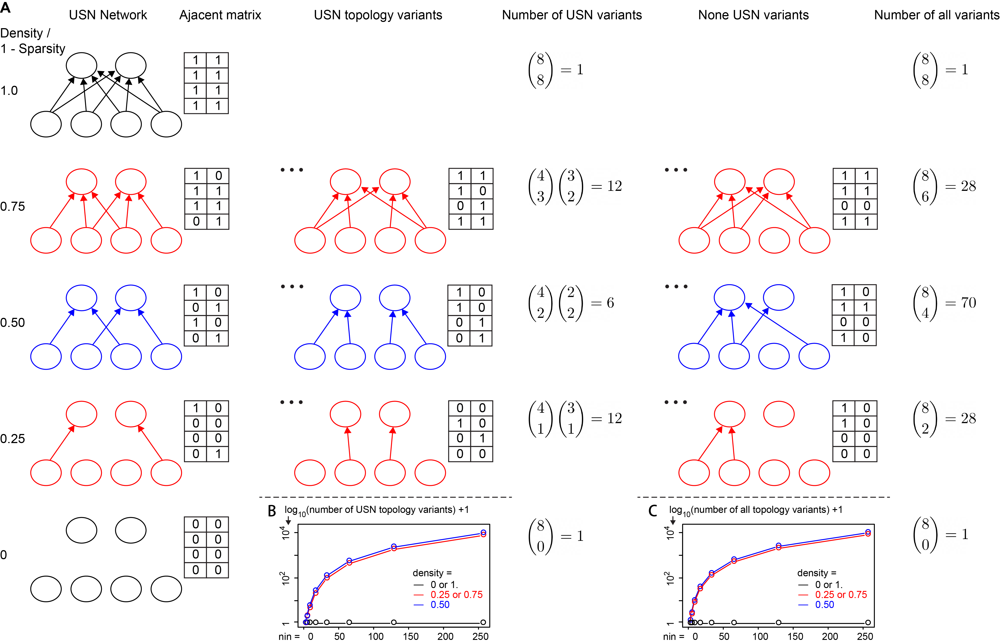

# Uniform Sparse Network (USN) and Sparse Neural Networks


## Overview

The novel uniform sparse network (USN) has even and sparse connectivity within each layer. USN
* is a natural generalization of the fully connected network (FCN);
* has one striking property that its performance is independent of the substantial topology variation and enormous model space;
* is static sparse neural network, search-free, robust and fast to train;
* can improve FCN in accuracy, robustness and scalability simultaneously by tunning the connection density/sparsity hyperparameter;
* is robust against overfitting, can easily scale up to big neural network without extra regularization (eg. dropout, L1 or L2 etc);
* shows the potential to fully replace FCN in a wide range of deep learning architectures and broad applications.

USN and random sparse networks are implemented in *sparsenet* as options of *sparse* layer class (USN is the default). *sparse* layer is very similar to the commonly used *Dense* layer in *Keras* and *tf.keras* in both coding and function, and intend to be a full replacement of *Dense* layer in all aspects and conditions. Just like *Dense* layer, *sparse* layer can be used as basic block for complex neural network and deep learning models. 



## Citation

Please cite the USN paper when using this open-source  package. This will help the project and our team:

Luo W. Improving Neural Network with Uniform Sparse Connectivity. IEEE Access, 2020, accepted, <a href=https://doi.org/10.1093/>doi to come</a>

## Installation (unix/linux/bash command line)

you can pip install sparsenet package from GitHub. This will also install the dependencies, eg TensorFlow and NumPy.

``` bash
pip install git+https://github.com/datapplab/sparsenet
```

Alternatively, you can download sparsenet package from GitHub. Note you need to have Python 3 (and NumPy) and TensorFlow 2.0 or above installed first.
``` bash
# pip install --upgrade tensorflow
cd /path/to/your/local/directory/
git clone https://github.com/datapplab/sparsenet.git
```

## Quick start (Python code)

As shown in the quick example below, *sparse* layer is used the same way as *Dense* layer, except with a few additional arguments like *density* (connection density or sparsity).

``` python
#import tensorflow
import tensorflow as tf

#import sparse
#need to specify the local path if sparsenet was downloaded/cloned instead of installed
#import sys
#sys.path.append('/path/to/your/local/directory/sparsenet')
from sparsenet.core import sparse

#define a simple two-layer neural network (MLP), X_train is your training data
model = tf.keras.models.Sequential([
  tf.keras.layers.Input(shape=X_train.shape[1]),
  # tf.keras.layers.Dense(128, activation=None),
  sparse(units=128, density=0.1, activation=None),
  # tf.keras.layers.Dense(10, activation='softmax')
  sparse(units=10, density=0.5, activation='softmax'),
])
```

## Tutorials with Full examples

In this repository, you can find two tutorials on USN and sparse neural networks. 
* [Tutorial on basic sparse neural networks with scRNA-Seq data](sparse_tutorial_basics_scRNA_Seq.ipynb) [](https://colab.research.google.com/github/datapplab/sparsenet/blob/main/sparse_tutorial_basics_scRNA_Seq.ipynb)
* [Tutorial on basic and deep sparse neural networks with MNIST data](sparse_tutorial_MNIST_CNN_RNN.ipynb) [](https://colab.research.google.com/github/datapplab/sparsenet/blob/main/sparse_tutorial_MNIST_CNN_RNN.ipynb)

## More information

Please check the tutorials, package documentation and <a href=https://>the USN paper</a> for more info.

You can reach the author at luo_weijun[AT]yahoo.com

Thank you for your interest.

